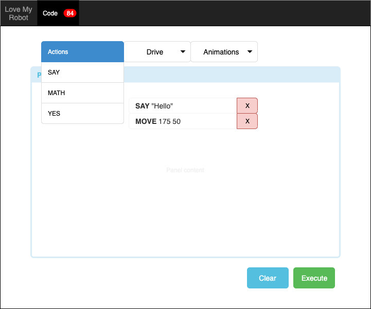

# GUI

En esta interfaz se podra programar de una manera:

- intuitiva
- que sea facil de ubicar cada elemento
- para un nino (colores, etc etc)

---

El usuario tendra un white board donde podra armar su programa en [LMR](lmr.md), este whiteboard e interfaz puede tener 2 approachs (pero no limitado a estos 2, si usted tiene una mejor maner de hacerlo es bienvenido a utillizar su manera)

- **Restricted:** Select => Click => Add predefined instructions; el usuario puede seleccionar de varias dropdowns de categorias cuál instruccion desea añadir. (esta es la opcion que se muestra en el [mock](#ui-mock)). Agregue un [ToDO list](examples.md#todo-list) como ejemplo de como puede anadir elementos on the fly.

- **Free Mode:** un modo mas avanzado, en donde se tendra siempre una lista (pero sera mas como ayuda), pero el usuario podra programar en un ["Live Text Editor"](examples.md#live-code-editor)

---
## UI Mock

 

- Observe como la categorias estan arriba del scratchboard
- vea la opcion de "X" de remover cada linea.
- Cada categoria tendra su [lista de comandos soportados](lmr.md)
- Hay un boton de "Ejecutar" (obligatorio) que enviara su codigo hacia [Lex](lex.md)
- No habra mas rutas que `/`, almenos que usted lo quiera distinto.

 
> A mockup is a visual way of representing a product, it is not written in stone, feel free to change, add, remove whatever you need to.

---

# Requeriments

- DEBE estar escrito y hecho en **NodeJS (Express JS)**
- Para el frontend puede utilizar Javascript como considere necesario
- Puede usar Server Side rendering y usar algun [template engine](https://expressjs.com/en/guide/using-template-engines.html), como recomendacion vea: [Mustache](https://www.npmjs.com/package/mustache) o Jade (Pug)