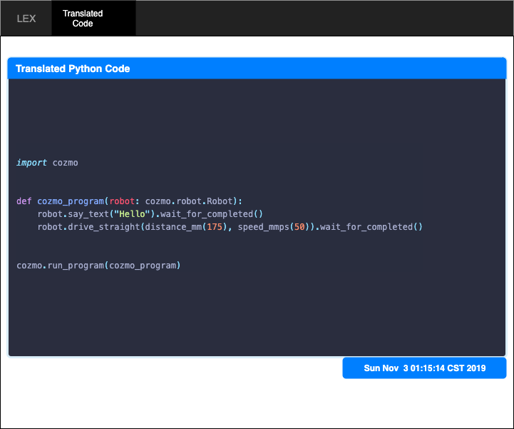

# Lex

Lex sera el API responsable de "Transpilar" su codigo escrito en LMR.

Tendra 2 `@routes` (no esta limitado a estos 2 unicamente, usted puede agregarle mas)

- `/`
- `/lex`

# /root

El root sera endpoint grafico que desplegara: el codigo Python Transpilado y la hora que fue hecho el request.




# /lex

POST endpoint para Procesar/ Ejecutar el codigo.

`Recibe LMR => [Lex] => Transpile to Python => [Execute to Cozmo]`

El codigo vendra en el request payload <sup>[1](#1footnote)</sup>

```json
{
    "request_timestamp": "Sun Nov  3 01:42:41 CST 2019",
    "lmr": "SAY HI\nMOVE 50 100"
}

```

<br>


Obviamente debe devolver un status code dependiendo del resultado de ejecutar el programa.


<a name="1footnote">1</a>: Ojo que se puede utilizar [Redis](redis.md) para evitar enviar una llamada REST y utilizar canales real-time.


<br><br><br><br>
> **Transpilers**, or source-to-source compilers, are tools that read source code written in one programming language, and produce the equivalent code in another language.
